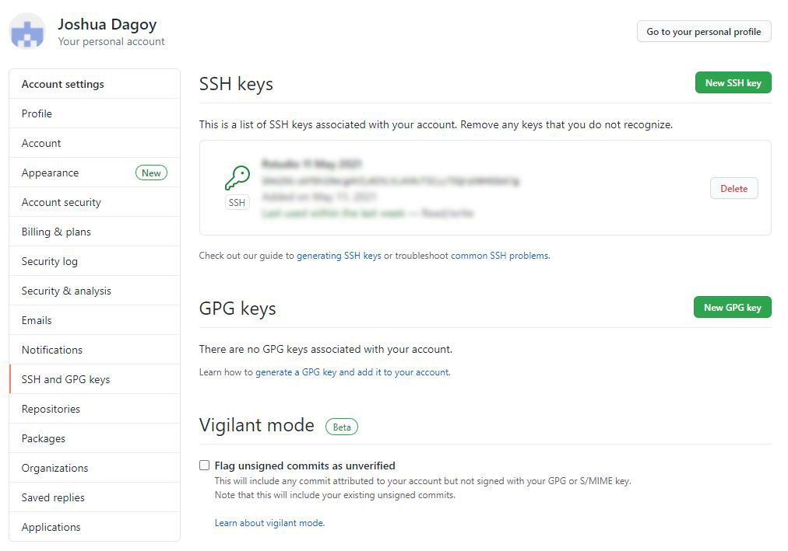

I have been thinking of creating a personal website focusing on research and academic work. I had previously developed websites (personal and for a small pest control company) using [WordPress](https://wordpress.org/) and had it hosted at [eHost](http://ehost.com/) (now JustHost) or at [Hostinger](https://www.hostinger.com/). At the time when I created those website, the two web hosting providers had the best deals and came with a free custom domain registration for a year. 

I initially did not know it was possible to create a website in `RStudio` until I came across of the `R` package `blogdown`. So here is how I did this website.

## Pre-requisites
* [R](https://cran.r-project.org/) and [RStudio](https://www.rstudio.com/)
* Git
* [GitHub](https://github.com/) account
* [Netlify](https://www.netlify.com/) account
* ***Optional:*** Your custom domain (cost varies depending on the domain name)

## Installing **Git**
First you have to install `Git` to your computer in order to connect to your `GitHub` repository.

* **Microsoft/Windows** - download [Git](https://gitforwindows.org/) for Windows
* **Linux** - open the terminal window and run the following code: 

```{bash, eval=F, echo=T}
sudo apt update
sudo apt upgrade
sudo apt install git
```

* **Mac** - install [Homebrew](https://brew.sh/) and Git by running the following code:
```{bash, eval=F, echo=T}
/bin/bash -c "$(curl -fsSL https://raw.githubusercontent.com/Homebrew/install/HEAD/install.sh)"
```

```{bash, eval=F, echo=T}
brew install git
```


## Setting up **Git** in **RStudio**
If you have installed R and RStudio before Git, it cannot locate the path of Git and you have to manually configure (in my case). If Git is installed correctly and Rstudio can find it, it can act as Graphical User Interface (GUI) front-end for Git. You do not have to do Git functions in the terminal.

To locate the `PATH` of Git, run the following in the terminal or Git Bash (after installing Git for Windows).

* **Microsoft/Windows**
```{bash, eval=F, echo=T}
where git
``` 
* **Mac/Linux**
```{bash, eval=F, echo=T}
which git
``` 

If Git is installed, take note of the path.

Launch `RStudio`, go to *Tools > Global Options > Git/SVN*. Locate the `PATH` of Git. Check the box of 'Enable version control interface for RStudio projects'. It should look like this: 

* **Microsoft/Windows** - `C:\Program Files\Git\cmd\git.exe`
* **Mac/Linux** - `/usr/bin/git`


Cick the **create RSA key** and ***copy the public key***, which we will need to connect your GitHub account. 


## Setting up **GitHub** and creating your **website repository**

Now head to [GitHub](https://github.com/). Create an account if you do not have one. 

Go to *Settings > SSH and GPG keys* and click the green **New SSH key** button and copy the RSA publi



Create a new repository. You can add a README file if you want to share your repository publicly.


Create repository. Click the green `Code` button and copy the highlighted part.


 In **RStudio**, create a New Project. *File > New Project > * ***Version Control > Git***.
 
 

Now, we can clone your Git repository. Supply the repository URL you copied from GitHub. Project directory name will automatically show the repository name. If you want to change the local location, click ***Browse*** and locate the folder where you want to store your project. *Take note that you will note be moving this directory as it might create problems*.

 
 
 You are now ready to start you personal website project **(Part II)**. 
 
